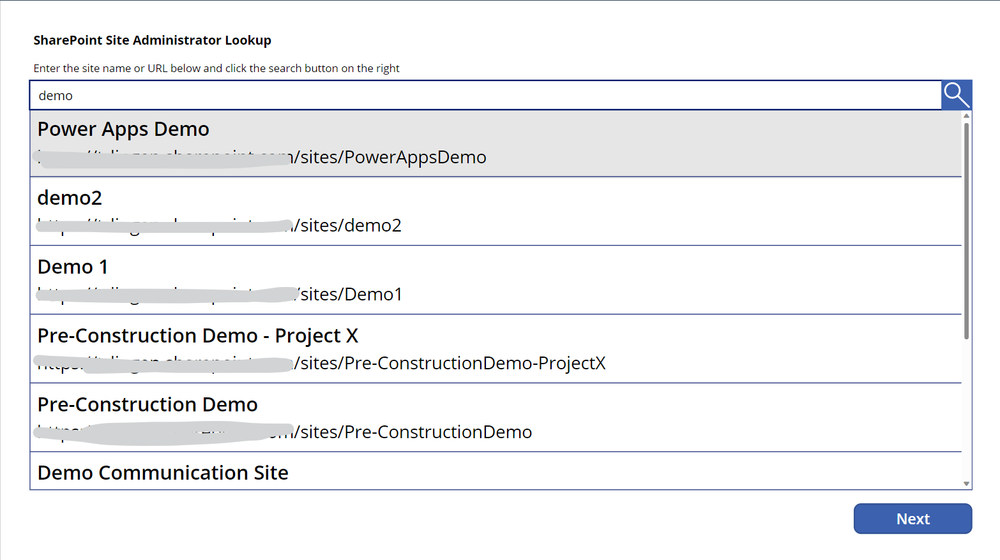
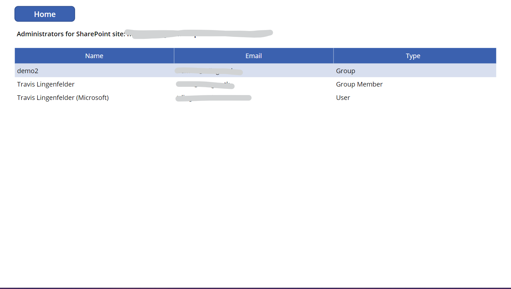

# Overview

This tool will allow anyone with permissions to the app to query for SharePoint site collection administrators without the need to have any permissions to the SharePoint site.

You can lookup a SharePoint site by its title, URL, or other search properties.

Once you select a site, it will show you a list of site collection adminstrators broken down into individual users, Azure AD group names with the owners of Azure AD groups expanded.

# Setup Guide
## Create an App Registration with the following API Permissions

|Service|Type|Permission|
|---|---|---|
|Microsoft Graph|Application|Group.Read.All|
|Microsoft Graph|Application|User.Read.All|
|SharePoint|Application|Sites.FullControl.All|

**Note:** The app uses a certificate for authentication and one must be generated and associated with the app registration.

## Create the Azure Function app

**Type:** PowerShell - 7.0

Use Visual Studio Code with the Azure Functions extension to publish to the Function App. The Function App project can be found in the .**\SPOMgmtTools-Function** folder.

Upload the *.PFX* certificate file to the Azure Function to **TLS/SSL settings** -> **Private Key Certificates (.pfx)**

Create the following Application Settings for the function app.

|Name|Value|
|---|---|
|ClientId|Application id of the app registration created.|
|SPOUrl|Tenant root SharePoint site URL|
|TenantId|The id of your tenant|
|WEBSITE_LOAD_CERTIFICATES|The thumbprint value for your certificate used.|

## Deploy the Power Apps Solution

Import the solution file found in the **.\Power Platform Solution** folder.

Once the solution is imported, edit both cloud flows (**SP Admin Lookup - Find Sites** and **SP Admin Lookup - Get Admins**). Add the function URL to the appropriate listed below for the value of th Initialize function Url action in each flow.

|Flow|Function|
|---|---|
|SP Admin Lookup - Find Sites|Search-SPOSites|
|SP Admin Lookup - Get Admins|Get-SiteCollectionAdmins|