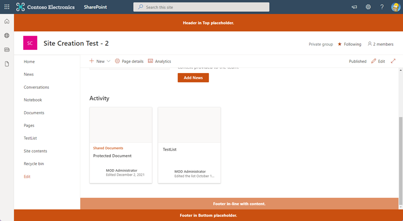

# spfx-header-footer

## Summary

Demonstrate techniques for injecting headers/footers onto the page. 

* Header in well-known Top content placeholder
* Footer in well-known Bottom content placeholder
* Inline footer appended to the end of the scrolling content section

## Used SharePoint Framework Version

## Applies to

- [SharePoint Framework](https://aka.ms/spfx)
- [Microsoft 365 tenant](https://docs.microsoft.com/en-us/sharepoint/dev/spfx/set-up-your-developer-tenant)

> Get your own free development tenant by subscribing to [Microsoft 365 developer program](http://aka.ms/o365devprogram)

## Prerequisites

> Any special pre-requisites?

## Version history

Version|Date|Author|Comments
-------|----|----|----
1.0|January 4, 2022|Travis Lingenfelder|Initial release

## Disclaimer

**THIS CODE IS PROVIDED *AS IS* WITHOUT WARRANTY OF ANY KIND, EITHER EXPRESS OR IMPLIED, INCLUDING ANY IMPLIED WARRANTIES OF FITNESS FOR A PARTICULAR PURPOSE, MERCHANTABILITY, OR NON-INFRINGEMENT.**

---

## Minimal Path to Awesome

- Clone this repository
- Ensure that you are at the solution folder
- **Add your site URL to ./config/serve.json**
- in the command-line run:
  - **npm install**
  - **gulp serve**

>