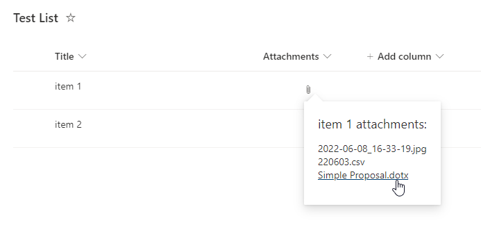

# spfx-field-attachment-popout

## Summary

This SPFx Field Customizer Extension will render a flyout showing attachment names as links when hovering over an attachment icon. A new site column will be created that is used to render this content.

## Used SharePoint Framework Version

## Applies to

- [SharePoint Framework](https://aka.ms/spfx)
- [Microsoft 365 tenant](https://docs.microsoft.com/en-us/sharepoint/dev/spfx/set-up-your-developer-tenant)

> Get your own free development tenant by subscribing to [Microsoft 365 developer program](http://aka.ms/o365devprogram)

## Prerequisites

> Any special pre-requisites?

## Solution

Solution|Author(s)
--------|---------
spfx-field-attachmentPopout | Travis Lingenfelder

## Version history

Version|Date|Comments
-------|----|--------
1.0.0.5|7/5/2022|Initial release

## Disclaimer

**THIS CODE IS PROVIDED *AS IS* WITHOUT WARRANTY OF ANY KIND, EITHER EXPRESS OR IMPLIED, INCLUDING ANY IMPLIED WARRANTIES OF FITNESS FOR A PARTICULAR PURPOSE, MERCHANTABILITY, OR NON-INFRINGEMENT. This sample code, scripts, and other resources are not supported under any Microsoft standard support program or service and are meant for illustrative purposes only. The sample code, scripts, and resources are provided AS IS without warranty of any kind. Microsoft further disclaims all implied warranties including, without limitation, any implied warranties of merchantability or of fitness for a particular purpose. The entire risk arising out of the use or performance of this material and documentation remains with you. In no event shall Microsoft, its authors, or anyone else involved in the creation, production, or delivery of the sample be liable for any damages whatsoever (including, without limitation, damages for loss of business profits, business interruption, loss of business information, or other pecuniary loss) arising out of the use of or inability to use the samples or documentation, even if Microsoft has been advised of the possibility of such damages.**

---

## Minimal Path to Awesome

- Clone this repository
- Ensure that you are at the solution folder
- in the command-line run:
  - **npm install**
  - **gulp serve**

> Include any additional steps as needed.

## Features

This feature will add a new site column called Attachments (internal name: AttachPopout) that you can add to your lists to show a flyout of the attachments for the current item.

This extension illustrates the following concepts:

- SharePoint Framework (SPFx) Field Customizer Extension
- SharePoint REST web service
- REACT Components
- Microsoft Fluent UI

> Notice that better pictures and documentation will increase the sample usage and the value you are providing for others. Thanks for your submissions advance.

## References

- [Getting started with SharePoint Framework](https://docs.microsoft.com/en-us/sharepoint/dev/spfx/set-up-your-developer-tenant)
- [Building for Microsoft teams](https://docs.microsoft.com/en-us/sharepoint/dev/spfx/build-for-teams-overview)
- [Use Microsoft Graph in your solution](https://docs.microsoft.com/en-us/sharepoint/dev/spfx/web-parts/get-started/using-microsoft-graph-apis)
- [Publish SharePoint Framework applications to the Marketplace](https://docs.microsoft.com/en-us/sharepoint/dev/spfx/publish-to-marketplace-overview)
- [Microsoft 365 Patterns and Practices](https://aka.ms/m365pnp) - Guidance, tooling, samples and open-source controls for your Microsoft 365 development