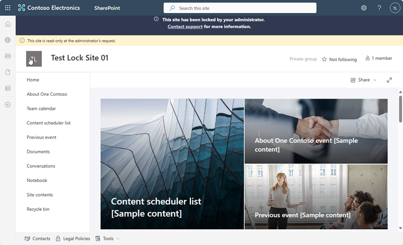
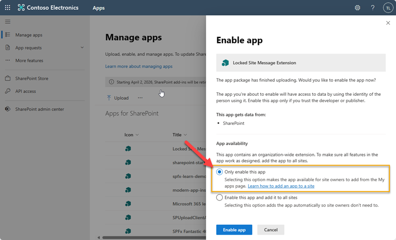

# locked-site-message

## Summary

This solution is used to place a header on the top of modern SharePoint pages for sites that are locked ReadOnly.

## Used SharePoint Framework Version

## Solution

| Solution    | Description                                              |
| ----------- | ------------------------------------------------------- |
| spfx-lockedSiteMessage | SPFx solution that is used to display a message in the site header. |
| Deploy-LockedSites.ps1 | PowerShell script to lock a batch of sites and deploy the message header soltuion to the site. |
| sampleInput.txt | Sample input file for a batch of sites to be locked with PowerShell. |

## Version history

| Version | Date             | Comments        |
| ------- | ---------------- | --------------- |
| 1.0.0.4 | March 8, 2024 | Initial release |

## Disclaimer

**THIS CODE IS PROVIDED _AS IS_ WITHOUT WARRANTY OF ANY KIND, EITHER EXPRESS OR IMPLIED, INCLUDING ANY IMPLIED WARRANTIES OF FITNESS FOR A PARTICULAR PURPOSE, MERCHANTABILITY, OR NON-INFRINGEMENT.**

**The sample code, scripts, and resources are provided AS IS without warranty of any kind. Microsoft further disclaims all implied warranties including, without limitation, any implied warranties of merchantability or of fitness for a particular purpose. The entire risk arising out of the use or performance of this material and documentation remains with you. In no event shall Microsoft, its authors, or anyone else involved in the creation, production, or delivery of the sample be liable for any damages whatsoever (including, without limitation, damages for loss of business profits, business interruption, loss of business information, or other pecuniary loss) arising out of the use of or inability to use the samples or documentation, even if Microsoft has been advised of the possibility of such damages.**

---

## How To Build and Deploy

- Clone this repository
- Ensure that you are at the **spfx-lockedSiteMessage** solution folder
- in the command-line run:
  - **npm install**
  - **gulp bundle --ship && gulp package-solution --ship**

> In order to build the solution you will have to have your development properly configured with the matching version of the SharePoint Framework.

- Browse to your tenant's SharePoint Administration Site.
  - i.e. `https://tenant-admin.sharepoint.com`

- Select **More Features** and then click the **Open** button under **Apps**.
- On the Manage Apps page, select the **Upload** button.
- Select the *spfx-lockedSiteMessage\sharepoint\solution\locked-ste-message.sppkg* file.
- Enable the app by clicking **Only enable this app**.
  
- Execute the PowerShell script to deploy a batch of sites as listed in a text file.

  `Deploy-LockedSite.ps1 -inputPath .\sampleInput.txt`

## Customie the Header Message

To customize the message you can customize the text in the **Deploy-LockedSites.ps1** file in the following line of code.

`$messageText = "This site has been <strong>locked</strong> by your administrator. <a href='mailto:support@mycompany,com'>Contact support</a> for more information."
`

 
